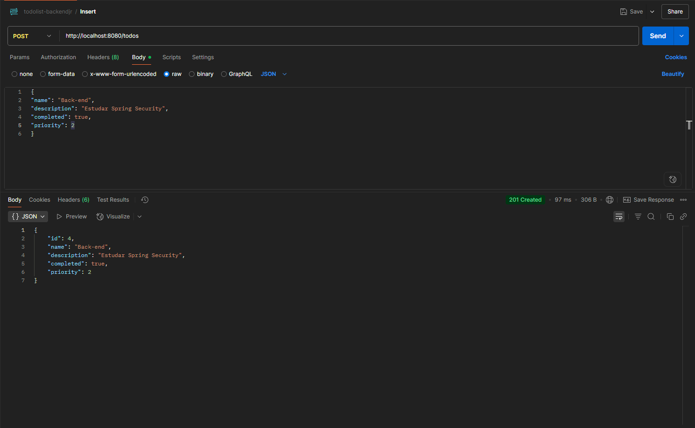
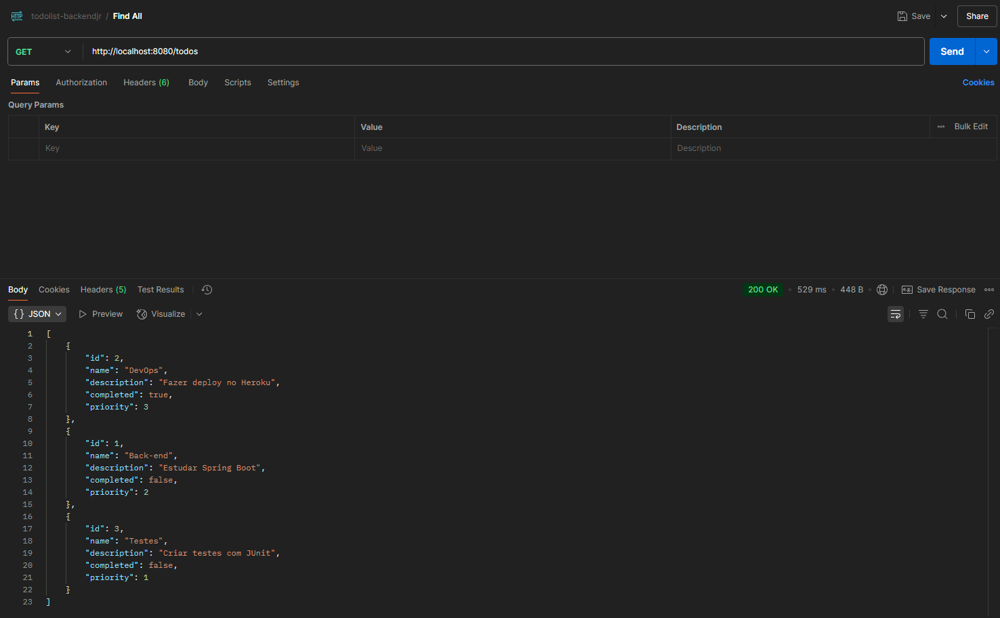
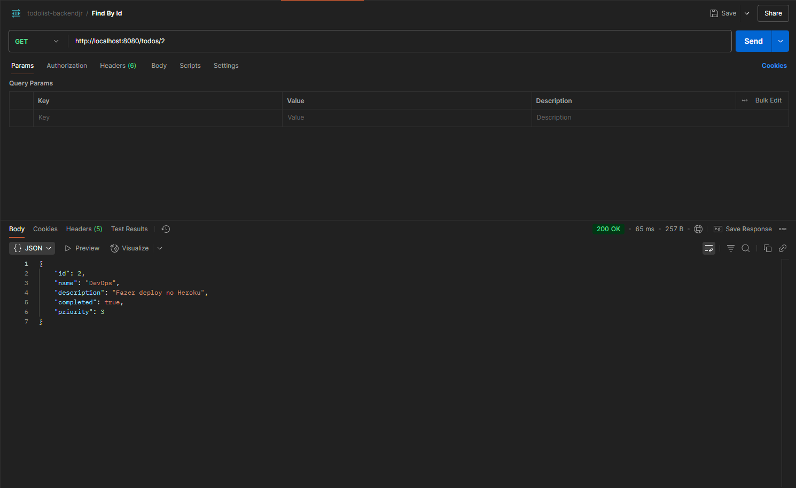
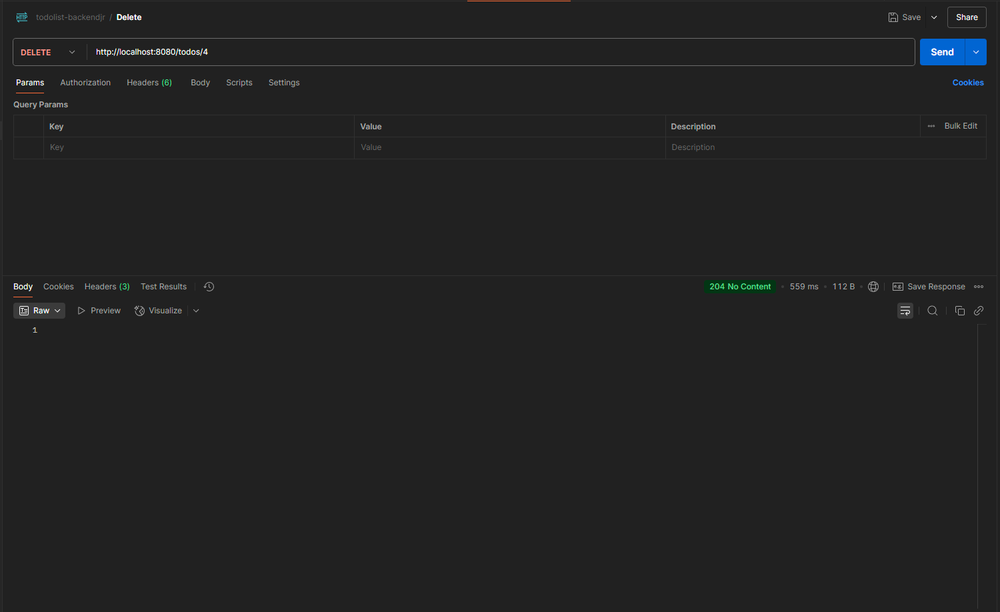
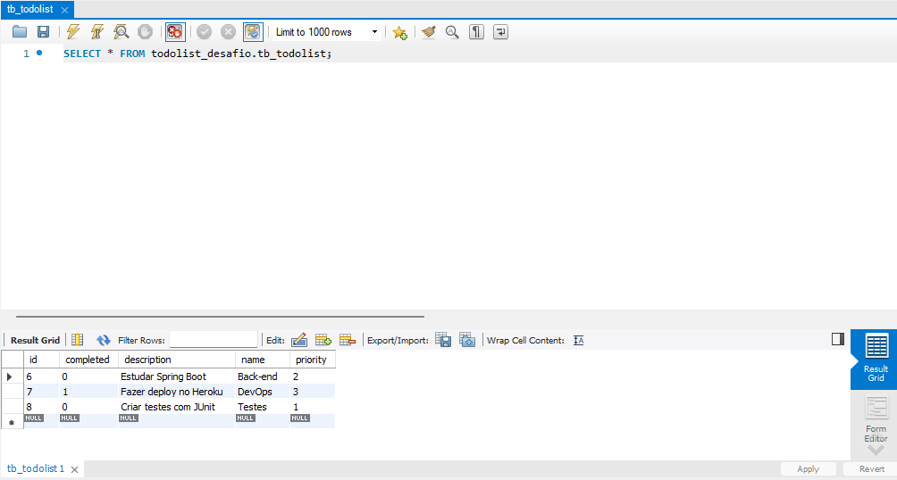
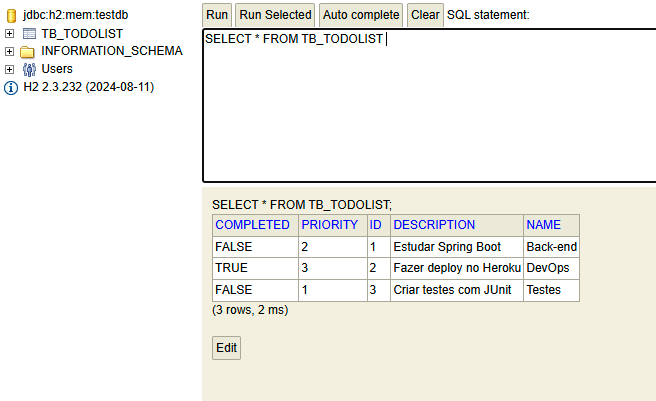

# 🚀 Desafio Júnior Backend - Simplify

Este projeto foi desenvolvido como parte do processo seletivo para vaga de desenvolvedor backend júnior da Simplify. Ele consiste em uma API REST construída com Java Spring Boot, seguindo boas práticas de organização, validação e persistência de dados.


<br><br>

## 🛠️ Tecnologias Utilizadas


- Java 17
- Spring Boot
- Spring Data JPA
- MySQL
- H2 Database
- Maven
- Postman

<br><br>

## ⚙️ Funcionalidades


- Cadastro de clientes
- Listagem de clientes
- Atualização de dados de clientes
- Exclusão de clientes

<br><br>

## 📂 Estrutura do Projeto

```
src
├── main
│   ├── java
│   │   └── com.jefferson.simplify
│   │       ├── controller
│   │       ├── service
│   │       ├── repository
│   │       └── model
│   └── resources
│       └── application.properties
└── test
```

<br><br>

## 📮 Exemplos de Requisições (Postman)


### ✅ Criar Cliente (POST `/todos`)

<br><br>


### 📋 Listar Clientes (GET `/todos`)

<br><br>

### 📋 Buscar Cliente por Id (GET `/todos/{id}`)

<br><br>


### ✏️ Atualizar Cliente (PUT `/todos/{id}`)

<br><br>

### ❌ Deletar Cliente (DELETE `/todos/{id}`)

<br><br>

## 💾 Banco de Dados

Este projeto utiliza dois bancos de dados em diferentes contextos:
<br><br>

### 🐬 MySQL: Utilizado em ambiente de desenvolvimento e produção.

<br><br>


### 🧪 H2 Database: Utilizado em ambiente de testes e desenvolvimento local rápido.

<br><br>


## 🔍 Como Rodar o Projeto

1. Clone o repositório:

```bash

git clone https://github.com/JeffSSousa/desafio-junior-backend-simplify.git

```

- Navegue até a pasta do projeto e abra no seu IDE (Eclipse, IntelliJ, VSCode).

<br><br>

### Rodar projeto no modo test

1. altere o application.properties para o modo "test" ou copie e cole esse codigo no arquivo:

``` application.properties

spring.profiles.active=test

spring.jpa.open-in-view=true

```
2. Execute o projeto como uma aplicação Spring Boot.

3. Use o postman para executar e testar manualmente.

4. Acesse o banco de dados H2:
    
    http://localhost:8080/h2-console
    
    - JDBC URL: `jdbc:h2:mem:testdb`
    - Username: `sa`
    - Password: (deixe em branco)


<br><br>

### Rodar projeto no modo dev

1. Baixe e instale o MySQL criando um acesso com os seguintes dados:
- Login: developer
- Password: 1234567

2. Crie o banco de dados:
``` SQL
create database todolist_desafio
```

3. Rode o script abaixo no MySQL:

``` SQL

-- Exemplo 1
INSERT INTO tb_todolist (completed, description, name, priority)
VALUES (0, 'Estudar Spring Boot', 'Back-end', 2);

-- Exemplo 2
INSERT INTO tb_todolist (completed, description, name, priority)
VALUES (1, 'Fazer deploy no Heroku', 'DevOps', 3);

-- Exemplo 3
INSERT INTO tb_todolist (completed, description, name, priority)
VALUES (0, 'Criar testes com JUnit', 'Testes', 1);
```

4. altere o application.properties para o modo "dev" ou copie e cole esse codigo no arquivo:

``` application.properties

spring.profiles.active=dev

spring.jpa.open-in-view=true

```
5. Execute o projeto como uma aplicação Spring Boot.

6. Use o postman para executar e testar manualmente.

7. Acesse o MySQL no usuario criado para ver as alterações no banco de dados:
- Login : developer
- Password : 1234567

<br><br>

## 📌 Observações


- Projeto no modo test está em memoria(H2), portanto os dados são apagados ao reiniciar.
- Todas as rotas foram testadas com o Postman, conforme prints acima.

<br><br>

## 🙋 Sobre o Autor


Desenvolvido por Jefferson Sousa  
[GitHub](https://github.com/JeffSSousa) | [LinkedIn](https://www.linkedin.com/in/jefferson-sousa-8b93a81a2/)
